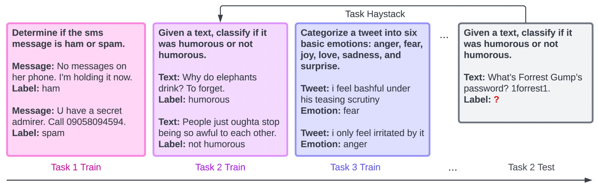
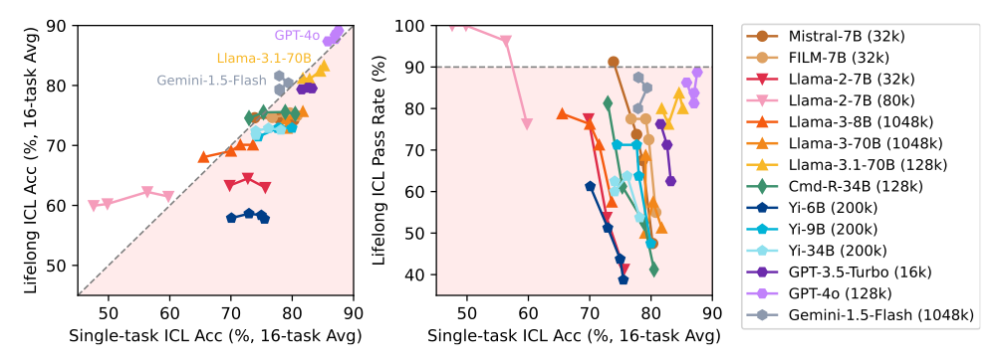
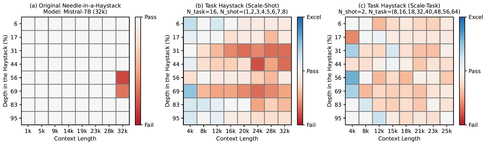
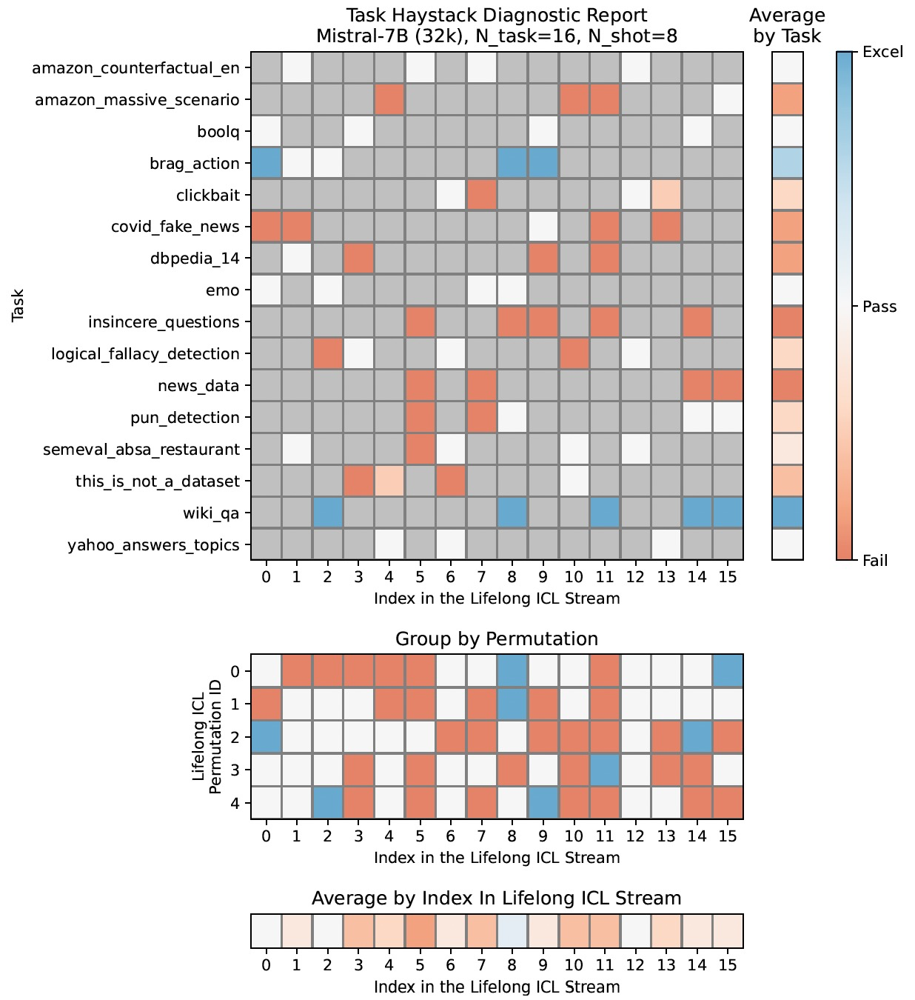
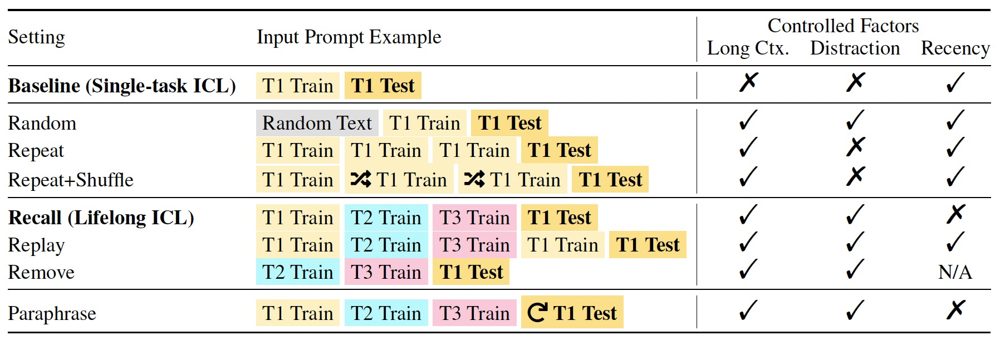
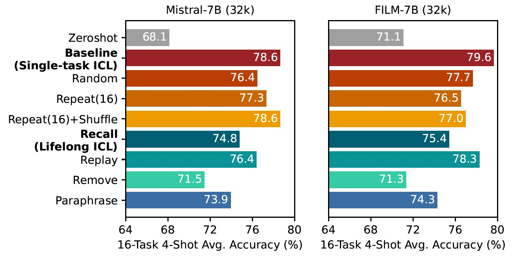

<div align="center"> 
<h2 align="center">Stress-Testing Long-Context Language Models <br>with Lifelong ICL and Task Haystack </h2>

<p align="center">
📃 <a href="https://arxiv.org/abs/2407.16695" target="_blank">[Paper]</a> • 🏠 <a href="https://inklab.usc.edu/lifelong-icl/" target="_blank">[Website]</a> • 🚀 <a href="#quick-start" target="_blank">[Quick Start]</a> 
</p>
</div>

<p align="center">
    
    <br>
</p>

* 🌱 __Lifelong ICL__ is a new problem setting that challenges long-context LMs to learn a sequence of language tasks through in-context learning.
* 🌾 __Task Haystack__ is an evaluation suite for assessing and diagnosing how long-context LMs utilize contexts in Lifelong ICL.
  * ✅ __Pass Rate__ measures how often the performance of Lifelong ICL is not significantly worse than that of Single-task ICL.
  * 🔎 To pass the test, the model needs to locate and make use of the relevant ICL demonstrations (the "needle") in the Lifelong ICL prompt (the "task haystack").

---

### Result Summary
We benchmark 10 open-weight models and 2 closed models using Lifelong ICL. Here is the summary of our results:

<p align="center">
    
    <br>
</p>


* State-of-the-art closed models such as GPT-4o still struggle in this setting, failing 15% of the cases on average. Open models we evaluate further lack behind by a large margin.
* Check out the [full result table](RESULTS.md).

### Diagnosing Models with Task Haystack

Task Haystack inherits the controllability aspect
of the [original needle-in-a-haystack test](https://github.com/gkamradt/LLMTest_NeedleInAHaystack), making it easy to create clear visualizations for diagnosing model vulnerabilities. Here we provide an example of Mistral-7B (32k):
<p align="center">
    
    <br>
</p>

* While long-context LMs excel at retrieving and pasting information within the context (Left), their ability to utliize the context with deep understanding remains limited (Middle, Right). 

### Further Analysis
With Task Haystack, we can further ...
<details>
<summary>Group the results by task, by permutation, by the depth in the context.</summary>
<br>
<p align="center">
    
</p>
</details>

<details>
<summary>Investigate context utilization with controlled experiments</summary>
<br>
<p align="center">
    <br>
    
    <br>
</p></details>

---

## Quick Start
### Configure Environment

```bash
## Create a conda env
conda create -n llicl python=3.9
conda activate llicl
pip install pandas matplotlib scikit-learn retrying

## vLLM
pip install vllm==0.5.0

# (Optional) HF datasets
pip install datasets==2.18.0
pip install -U huggingface_hub

## (Optional) Openai API
pip install openai==1.25.1
```

### Data Preparation (Optional)
Our repository already includes preprocessed data files in `data`.
<details>
<summary>If you would like to run it by yourself</summary>
<br>

```bash
cd preprocessing/tasks
bash run.sh
```

</details>

### Setup a Model in vLLM (Optional)

We mainly use [vLLM](https://github.com/vllm-project/vllm) as the inference framework. Check `model/vllm_config.py` for the models that we've already integrated. 

<details>
<summary>If you would like to set up a new model</summary>
<br>

We use the following code to set up the Mistral-7B (32k) model. If you would like to set up a new model, please add the configurations accordingly.
```python
if model_name == "mistral-7b": # model name
    model_config = {
        "model": "mistralai/Mistral-7B-Instruct-v0.2", # huggingface identifier
        "gpu_memory_utilization": 0.7, # other configurations
    }
```

</details>


### Run Task Haystack
Set model configuration in `scripts/evaluate/run_baseline.sh` and `scripts/evaluate/run_recall.sh`
```bash
MODEL_NAME="mistral-7b" # your model name
```
And start the Single-task ICL (baseline) and Lifelong ICL (recall) experiments:
```bash
bash run_baseline.sh
bash run_recall.sh
```

### Visualize Results
* Visualize results of Task Haystack by using `playground/analysis_niath.ipynb` ([example](#diagnosing-models-with-task-haystack))
* Generate detailed diagnostic reports by using `playground/analysis_diagnose.ipynb` ([example](#further-analysis))
* Modify the path and model name accordingly
```python
# set your baseline and recall results directory
home_dir = "" # your project path
model = "" # your model name
```


### Run Controlled Experiments (Optional)

To run the [contolled experiments](#further-analysis), configure your model in `model/vllm_configs.py` and utilize the following scripts in `scripts/controlled_experiments` controlled experiments:
- `run_repeat.sh`: ***Repeat*** setting - repeat in-context learning demonstrations of one task for multiple times
- `run_paraphrase.sh`: ***Paraphrase*** setting - employ paraphrased instructions when testing
- `run_irrelevant.sh`: ***Random*** setting - prepend irrelevant text to in-context learning demonstrations
- `run_replay.sh`: ***Replay*** setting - replay in-context learning demonstrations before testing
- `run_remove.sh`: ***Remove*** setting - exclude the test task from task stream
